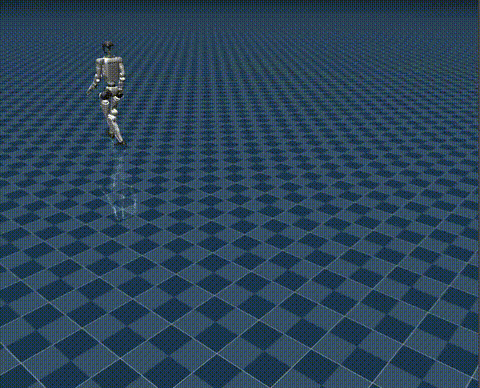
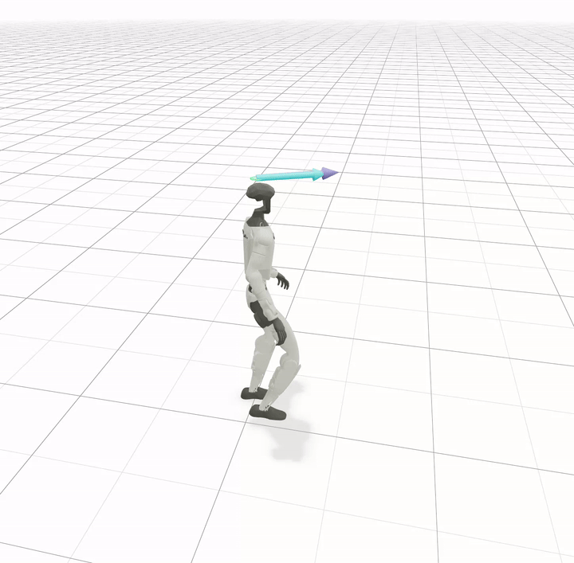
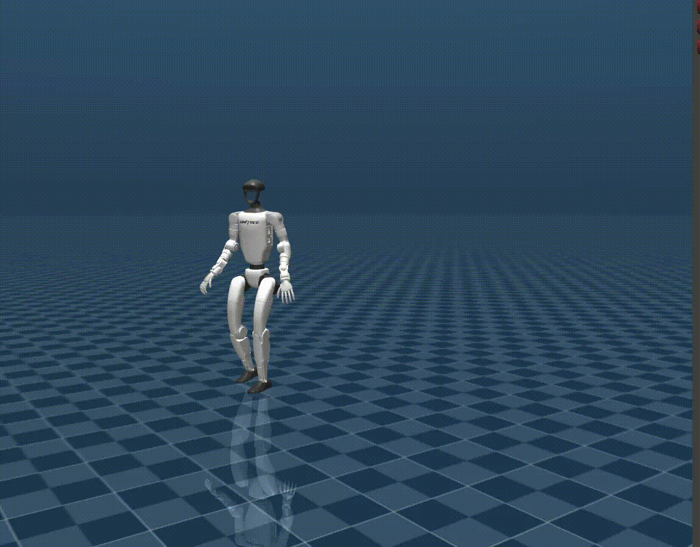

# unitree_amp_mjlab

## Overview

`unitree_amp_mjlab` is a reinforcement learning codebase built on MJLab for AMP-based Unitree G1 humanoid locomotion.

## Installation
**Conda environment**

```bash
conda create -n mjlab python=3.11
conda activate mjlab
```

**Install dependencies**
```bash
sudo apt install -y libyaml-cpp-dev libboost-all-dev libeigen3-dev libspdlog-dev libfmt-dev
```

**Install unitree_amp_mjlab**
```bash
git clone https://github.com/yhx1203/unitree_amp_mjlab
```

```bash
cd unitree_amp_mjlab
pip install -e .
```


## Training
```bash
# You can visualize the motion before training
python scripts/view_csv_in_mujoco.py src/assets/motions/g1/walk1_subject1_0_1400.csv \
  --once \
  --speed 3
```


```bash
python scripts/train.py Unitree-G1-AMP-Flat \
  --env.scene.num-envs 4096 \
  --agent.run-name amp_walk_test \
  --agent.upload-model False
```


## Evaluate
**native**
```bash
python scripts/play.py Unitree-G1-AMP-Flat \
  --checkpoint-file logs/rsl_rl/g1_amp_walking/amp_walk_test/model_1000.pt \
  --num-envs 1 \
  --viewer native
```


**viser**
```bash
python scripts/play.py Unitree-G1-AMP-Flat \
  --checkpoint-file logs/rsl_rl/g1_amp_walking/amp_walk_test/model_1000.pt \
  --num-envs 1 \
  --viewer viser
```



## Sim2sim 
```bash
python scripts/sim2sim_mujoco_g1_amp.py \
  --checkpoint-file logs/rsl_rl/g1_amp_walking/amp_walk_test/model_1000.pt \
  --cmd-x 0.5 \
  --cmd-yaw 0.0
```



## Acknowledgements

This project builds upon and benefits from the following open-source repositories:

- [mjlab](https://github.com/mujocolab/mjlab)
- [unitree_rl_mjlab](https://github.com/unitreerobotics/unitree_rl_mjlab)
- [TienKung-Lab](https://github.com/Open-X-Humanoid/TienKung-Lab)
